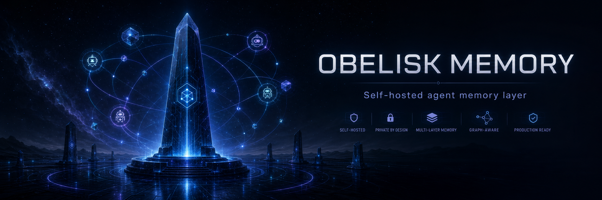
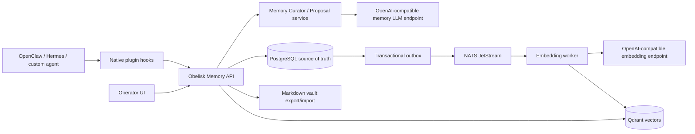

# Obelisk Memory



**Obelisk Memory** is a self-hosted, production-shaped memory plane for AI
agents. It gives OpenClaw, Hermes, custom workers, and future agent runtimes a
shared long-lived memory layer without turning the system into a SaaS dependency.

## What it is

Obelisk Memory is a Docker-deployable server that stores, indexes, curates, and
serves agent memory through a stable HTTP API and native agent integration hooks.
It is designed for a local-first or team-owned environment:

- one server owned by the operator;
- PostgreSQL as the source of truth;
- Qdrant for semantic recall;
- NATS JetStream + outbox relay for async indexing;
- Markdown vault export/import for human inspection and editing;
- web operator UI for recall, graph, conflicts, vault, and model settings;
- OpenAI-compatible memory-reasoning endpoint for provider-neutral curation;
- real OpenAI-compatible embedding endpoint support for production semantic search.

This is intentionally not a hosted SaaS architecture.

## Production status

Current verified baseline, July 10, 2026:

| Area | Status |
|---|---|
| API server | Production-shaped FastAPI service with health, metrics, auth, OpenAPI |
| Storage | PostgreSQL migrations, CAS supersede, idempotency, backup/restore |
| Vector search | Qdrant adapter + embedding worker + real embedding endpoint support |
| Async pipeline | Transactional outbox, NATS JetStream relay, dead-letter path |
| Memory reasoning | OpenAI-compatible chat endpoint, provider-neutral config, fail-soft fallback |
| Context | 128k recall budget and `top_k` up to 1000 candidates |
| Human vault | Markdown/Obsidian-style export, dry-run import, safe supersede |
| UI | React/Vite operator dashboard served by Docker on `/ui` |
| Agent integration | Native OpenClaw plugin and Hermes memory provider adapters |
| Tests | Unit/integration contracts, Docker config checks, live benchmark suite |

This means the repository is ready for a trusted local/team pilot. It is not yet
“full production” in the strong sense. Full production still requires
target-environment preflight reports for schedules, secret custody, network
boundary, OpenClaw/Hermes soak, live model endpoints and release evidence
preservation.

Honest gap audit:
[docs/PRODUCTION_GAP_AUDIT_2026_07_10.md](docs/PRODUCTION_GAP_AUDIT_2026_07_10.md).
Latest benchmark report: [docs/BENCHMARK_RESULTS_2026_07_09.md](docs/BENCHMARK_RESULTS_2026_07_09.md).

## Architecture



The API never depends on vector/LLM success to answer a request. Qdrant,
embedding, and memory LLM failures degrade recall quality but should not make
the agent runtime unusable.

## Quick start for local development

```bash
docker compose --profile advanced up -d --build
curl http://localhost:6798/health
open http://localhost:6798/ui
```

Local host ports are intentionally non-standard:

| Service | Host | Container |
|---|---:|---:|
| API/UI | `6798` | `8080` |
| PostgreSQL | `6548` | `5432` |
| Qdrant HTTP/gRPC | `6799` / `6800` | `6333` / `6334` |
| MinIO API/console | `6900` / `6901` | `9000` / `9001` |
| NATS client/monitoring | `6422` / `6822` | `4222` / `8222` |

The local compose file is convenient for debugging. For a real deployment, use
the production compose described below: it exposes only the API/UI port and keeps
PostgreSQL, Qdrant, NATS, and MinIO internal.

## Production deployment

1. Create a production environment file:

   ```bash
   cp .env.production.example .env.production
   # edit secrets and model endpoints
   ```

2. Start the production stack:

   ```bash
   docker compose -f docker-compose.prod.yml --env-file .env.production up -d --build
   ```

   For a host reachable from another machine, use the TLS reverse-proxy overlay:

   ```bash
   docker compose \
     -f docker-compose.prod.yml \
     -f deploy/reverse-proxy/docker-compose.caddy.yml \
     --env-file .env.production \
     up -d --build
   ```

3. Check health and metrics:

   ```bash
   curl http://localhost:6798/health
   curl -H "Authorization: Bearer $UAM_API_KEY" http://localhost:6798/metrics
   ```

4. Run the benchmark/readiness gates:

   ```bash
   python scripts/validate_production_env.py .env.production \
     --require-public-tls \
     --require-signed-artifacts \
     --require-real-embeddings
   python scripts/benchmark_suite.py
   UAM_API_KEY=... python scripts/agent_soak_eval.py \
     --base-url http://127.0.0.1:6798 \
     --json-report ./ops/agent-soak.json
   UAM_API_KEY=... python scripts/ui_walkthrough_eval.py \
     --base-url http://127.0.0.1:6798 \
     --json-report ./ops/ui-walkthrough.json
   UAM_API_KEY=... python scripts/deployment_preflight.py \
     --public-url https://memory.example.com \
     --backend-url http://memory.example.com:6798 \
     --report ./ops/deployment-preflight.json
   python scripts/secret_files_preflight.py .env.production \
     --report ./ops/secret-files.json
   python scripts/ops_schedule_preflight.py .env.production \
     --backup-schedule-file ./deploy/schedules/backup.timer \
     --audit-retention-schedule-file ./deploy/schedules/audit-retention.timer \
     --metrics-schedule-file ./deploy/schedules/metrics-health.timer \
     --backup-artifact-root s3://obelisk-memory/backups \
     --audit-artifact-root s3://obelisk-memory/audit \
     --report ./ops/ops-schedule.json
   python scripts/observability_preflight.py \
     --grafana-dashboard ./deploy/observability/grafana-dashboard.json \
     --prometheus-alerts ./deploy/observability/prometheus-alerts.yml \
     --report ./ops/observability-preflight.json
   UAM_VAULT_SIGNING_KEY=... python scripts/export_vault.py ./vault-review
   UAM_VAULT_SIGNING_KEY=... python scripts/import_vault.py ./vault-review \
     --require-signature \
     --json-report ./ops/vault-import.json
   python scripts/real_memory_llm_eval.py \
     --base-url https://api.openai.com/v1 \
     --model gpt-5.6-terra \
     --json-report ./ops/memory-llm.json
   python scripts/generate_release_notes.py \
     --release 2026.07.10 \
     --previous-ref v2026.07.09 \
     --current-ref HEAD \
     --evidence-manifest ./release-evidence.json \
     --output ./ops/release-notes.json
   python scripts/enterprise_readiness_check.py
   ```

Production notes:

- put TLS and IP allowlisting in front of `6798` if the service leaves localhost;
- never expose PostgreSQL, Qdrant, NATS, or MinIO directly to an untrusted LAN;
- set `UAM_API_KEY` to a long random secret;
- prefer scoped `UAM_API_KEYS` for agents and UI operators:
  `openclaw:<secret>:agent,hermes:<secret>:agent,operator:<secret>:operator`;
- keep backups outside Docker volumes;
- pin and test embedding/model dimensions before changing providers.

Full runbook: [docs/OPERATIONS_RUNBOOK.md](docs/OPERATIONS_RUNBOOK.md). TLS
guide: [docs/TLS_REVERSE_PROXY.md](docs/TLS_REVERSE_PROXY.md). Security policy:
[SECURITY.md](SECURITY.md).

## API examples

Retain a memory:

```bash
curl -X POST http://localhost:6798/v1/memory/retain \
  -H "Authorization: Bearer $UAM_API_KEY" \
  -H "Content-Type: application/json" \
  -d '{
    "layer": "semantic",
    "scope": "workspace",
    "kind": "fact",
    "text": "Основной язык проекта — Python",
    "agent_id": "11111111-1111-1111-1111-111111111111",
    "idempotency_key": "example-1"
  }'
```

Recall context:

```bash
curl -X POST http://localhost:6798/v1/memory/recall \
  -H "Authorization: Bearer $UAM_API_KEY" \
  -H "Content-Type: application/json" \
  -d '{"query":"Какой язык используется в проекте?","top_k":20}'
```

Store a conversation turn for later curation:

```bash
curl -X POST http://localhost:6798/v1/conversations/turns \
  -H "Authorization: Bearer $UAM_API_KEY" \
  -H "Content-Type: application/json" \
  -d '{
    "session_id": "agent-run-42",
    "role": "user",
    "text": "Запомни: продовый порт API — 6798."
  }'
```

OpenAPI docs are available at `http://localhost:6798/docs` when authorized.

## Provider-neutral memory LLM endpoint

Obelisk Memory separates memory reasoning from embeddings. The memory LLM handles
curation, proposals, compacting, and future graph extraction.
OpenAI-compatible means the API shape, not provider lock-in. Obelisk uses the
`/v1/chat/completions` contract so the same configuration can point at OpenAI,
OpenRouter, LiteLLM, vLLM, llama.cpp, Spark/DGX, or another compatible gateway:

```dotenv
UAM_MEMORY_LLM_PROVIDER=openai-compatible
UAM_MEMORY_LLM_MODEL=gpt-5.6-terra
UAM_MEMORY_LLM_BASE_URL=https://api.openai.com/v1
UAM_MEMORY_LLM_API_KEY=...
UAM_MEMORY_LLM_CONTEXT_TOKENS=131072
UAM_MEMORY_LLM_MAX_TOKENS=1600
UAM_MEMORY_LLM_ENABLE_THINKING=false
```

The values above are one deployable profile, not a product lock. Keep the
contract and replace `UAM_MEMORY_LLM_BASE_URL`, `UAM_MEMORY_LLM_MODEL`, and the
key with the selected provider's values. Examples: OpenAI model IDs, OpenRouter
model IDs, a LiteLLM gateway route, vLLM served model names, llama.cpp server
model aliases, or a Spark/DGX Qwen endpoint.

Embedding model configuration is separate:

```dotenv
UAM_EMBEDDING_PROVIDER=openai
UAM_EMBEDDING_MODEL=text-embedding-3-large
UAM_EMBEDDING_DIM=3072
UAM_EMBEDDING_BASE_URL=https://api.openai.com/v1
UAM_EMBEDDING_API_KEY=...
UAM_QDRANT_PAYLOAD_TEXT=false
UAM_MEMORY_TEXT_ENCRYPTION=pgcrypto
UAM_MEMORY_TEXT_ENCRYPTION_KEY=...
```

Production secrets can be supplied as mounted files instead of raw environment
variables. For example:

```dotenv
UAM_API_KEY_FILE=/run/secrets/uam_api_key
UAM_API_KEYS_FILE=/run/secrets/uam_scoped_api_keys
UAM_MEMORY_LLM_API_KEY_FILE=/run/secrets/model_gateway_key
UAM_EMBEDDING_API_KEY_FILE=/run/secrets/embedding_gateway_key
UAM_MEMORY_TEXT_ENCRYPTION_KEY_FILE=/run/secrets/memory_text_key
UAM_AUDIT_SIGNING_KEY_FILE=/run/secrets/audit_signing_key
UAM_VAULT_SIGNING_KEY_FILE=/run/secrets/vault_signing_key
```

Direct variables still work for development; `*_FILE` is preferred for
production secret managers.

For local self-hosted alternatives, see
[docs/DGX_SPARK_MEMORY_LLM.md](docs/DGX_SPARK_MEMORY_LLM.md) and
[docs/DGX_SPARK_EMBEDDINGS.md](docs/DGX_SPARK_EMBEDDINGS.md).

In production, keep `UAM_QDRANT_PAYLOAD_TEXT=false`. Qdrant then stores vectors
and filter metadata only; recalled text is hydrated from the canonical
PostgreSQL ledger.

For production PostgreSQL storage, keep `UAM_MEMORY_TEXT_ENCRYPTION=pgcrypto`
and provide `UAM_MEMORY_TEXT_ENCRYPTION_KEY` from an external secret manager.
The application sees normal text after loading from the ledger, while
`memory_items.text` is stored as `enc:pgcrypto:v1:*` ciphertext.
By default `UAM_MEMORY_TEXT_ENCRYPTION_SCOPES=all`; operators can use a
comma-separated scope list such as `private,thread` when only selected
visibility scopes need row-level ciphertext.

## Agent integration

The intended integration is native runtime hooks, not a thin skill prompt and not
MCP-only:

- before run: recall stable project, user, tool, and task context;
- before model call: inject a compact context package;
- after tool call/message: retain observations, traces, and errors;
- checkpoint: save working state for resume;
- run complete: retain summary and trigger reflection/curation.

Adapters live in [agent-integrations/](agent-integrations/):

- OpenClaw: `agent-integrations/openclaw/plugin`;
- Hermes: `agent-integrations/hermes/universal_agent_memory`;
- shared Python helpers: `agent-integrations/shared`.

Before a production rollout, run the live agent soak gate against the same
server the agents will use:

```bash
UAM_API_KEY=... python scripts/agent_soak_eval.py \
  --base-url http://127.0.0.1:6798 \
  --rounds 5 \
  --parallel 4 \
  --json-report ./ops/agent-soak.json
```

The report must show `ok: true`. It verifies OpenClaw/Hermes-style writes,
recall, idempotent retries, and cross-workspace leakage checks. It is runtime
evidence, not a substitute for installing the native plugins.

Detailed integration guide:
[docs/AGENT_INTEGRATION.md](docs/AGENT_INTEGRATION.md).

## Human-editable vault

Operators can export memory to Markdown and open it in Obsidian or any editor:

```bash
docker compose --profile ops run --rm vault-export
```

Imports default to dry-run and use safe CAS supersede instead of destructive
overwrites:

```bash
docker compose --profile ops run --rm vault-import
docker compose --profile ops run --rm vault-import python scripts/import_vault.py /vault \
  --require-signature \
  --json-report /vault/vault-import.json \
  --apply
```

Vault guide: [docs/VAULT.md](docs/VAULT.md).

## Validation gates

Recommended before every production rollout:

```bash
ruff check src tests scripts agent-integrations
pytest -q
docker compose --profile advanced config
docker compose -f docker-compose.prod.yml config
python scripts/validate_production_env.py .env.production \
  --require-public-tls \
  --require-signed-artifacts \
  --require-real-embeddings
UAM_API_KEY=... python scripts/agent_soak_eval.py --json-report ./ops/agent-soak.json
UAM_API_KEY=... python scripts/load_smoke_eval.py --json-report ./ops/load-smoke.json
UAM_API_KEY=... python scripts/ui_walkthrough_eval.py --json-report ./ops/ui-walkthrough.json
UAM_API_KEY=... python scripts/deployment_preflight.py \
  --public-url https://memory.example.com \
  --backend-url http://memory.example.com:6798 \
  --report ./ops/deployment-preflight.json
python scripts/secret_files_preflight.py .env.production \
  --report ./ops/secret-files.json
python scripts/ops_schedule_preflight.py .env.production \
  --backup-schedule-file ./deploy/schedules/backup.timer \
  --audit-retention-schedule-file ./deploy/schedules/audit-retention.timer \
  --metrics-schedule-file ./deploy/schedules/metrics-health.timer \
  --backup-artifact-root s3://obelisk-memory/backups \
  --audit-artifact-root s3://obelisk-memory/audit \
  --report ./ops/ops-schedule.json
python scripts/observability_preflight.py \
  --grafana-dashboard ./deploy/observability/grafana-dashboard.json \
  --prometheus-alerts ./deploy/observability/prometheus-alerts.yml \
  --report ./ops/observability-preflight.json
UAM_VAULT_SIGNING_KEY=... python scripts/export_vault.py ./vault-review
UAM_VAULT_SIGNING_KEY=... python scripts/import_vault.py ./vault-review \
  --require-signature \
  --json-report ./ops/vault-import.json
python scripts/real_memory_llm_eval.py --json-report ./ops/memory-llm.json
UAM_AUDIT_SIGNING_KEY=... PYTHONPATH=src python scripts/audit_retention.py \
  --database-url "$UAM_DATABASE_URL" \
  --retain-days 365 \
  --export-root ./audit-retention \
  --json-report ./ops/audit-retention.json
python scripts/generate_release_notes.py \
  --release 2026.07.10 \
  --previous-ref v2026.07.09 \
  --current-ref HEAD \
  --evidence-manifest ./release-evidence.json \
  --output ./ops/release-notes.json
python scripts/generate_release_evidence_manifest.py \
  --release 2026.07.10 \
  --output ./release-evidence.json
python scripts/verify_release_evidence.py ./release-evidence.json
python scripts/benchmark_suite.py
python scripts/enterprise_readiness_check.py
```

The benchmark suite covers config contracts, API memory contracts, memory LLM
wiring, in-memory vector recall, 128k context compilation, agent integration
defaults, web build, Docker state, live HTTP API, live memory LLM, and live
embeddings when configured endpoints are reachable. Passing these checks is not a
substitute for the production gates in the gap audit.

## Documentation map

- [docs/ARCHITECTURE.md](docs/ARCHITECTURE.md) — internal architecture.
- [docs/CONTRACTS.md](docs/CONTRACTS.md) — API/data contracts.
- [docs/FUNCTION_CATALOG.md](docs/FUNCTION_CATALOG.md) — function ownership map.
- [docs/PRODUCTION_READINESS_TESTING.md](docs/PRODUCTION_READINESS_TESTING.md) — test plan.
- [docs/PRODUCTION_GAP_AUDIT_2026_07_10.md](docs/PRODUCTION_GAP_AUDIT_2026_07_10.md) — honest production gaps.
- [docs/OPERATIONS_RUNBOOK.md](docs/OPERATIONS_RUNBOOK.md) — production operations.
- [docs/OBSERVABILITY.md](docs/OBSERVABILITY.md) — Prometheus/Grafana monitoring.
- [docs/TLS_REVERSE_PROXY.md](docs/TLS_REVERSE_PROXY.md) — HTTPS/reverse proxy deployment.
- [docs/ENTERPRISE_READINESS.md](docs/ENTERPRISE_READINESS.md) — readiness checklist.
- [docs/RELEASE_EVIDENCE.md](docs/RELEASE_EVIDENCE.md) — release evidence manifest.
- [docs/GITHUB_BRANCH_PROTECTION.md](docs/GITHUB_BRANCH_PROTECTION.md) — PR-only release gate.
- [docs/ROADMAP_PHASE_4_ARCHIVAL_MEMORY.md](docs/ROADMAP_PHASE_4_ARCHIVAL_MEMORY.md) — archival memory roadmap.
- [docs/WEB_DASHBOARD.md](docs/WEB_DASHBOARD.md) — UI guide.

## License

Apache-2.0.
