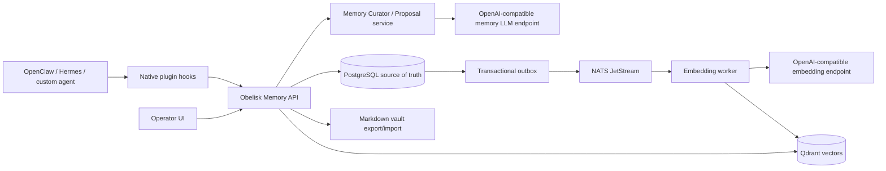

# Obelisk Memory


**Obelisk Memory** is a self-hosted memory plane for AI
agents. It gives OpenClaw, Hermes, custom workers, and future agent runtimes a
shared long-lived memory layer without turning the system into a SaaS dependency.

## What it is

Obelisk Memory is a Docker-deployable server that stores, indexes, curates, and
serves agent memory through a versioned HTTP API and native agent integration hooks.
It is designed for a local-first or team-owned environment:

- one server owned by the operator;
- PostgreSQL as the source of truth;
- Qdrant for semantic recall;
- NATS JetStream + outbox relay for async indexing;
- Markdown vault export/import for human inspection and editing;
- web operator UI for recall, graph, conflicts, vault, and model settings;
- OpenAI-compatible memory-reasoning endpoint for provider-neutral curation;
- real OpenAI-compatible embedding endpoint support for production semantic search.

This is intentionally not a hosted SaaS architecture.

## Release status

Repository capability baseline:

| Area | Status |
|---|---|
| API server | Production-shaped FastAPI service with health, metrics, auth, OpenAPI |
| Storage | PostgreSQL migrations, CAS revisions, idempotency, backup/restore tooling |
| Vector search | Qdrant adapter + embedding worker + real embedding endpoint support |
| Async pipeline | Transactional outbox, NATS JetStream relay, dead-letter path |
| Memory reasoning | OpenAI-compatible chat endpoint, provider-neutral config, fail-soft fallback |
| Context | 128k recall budget and `top_k` up to 1000 candidates |
| Human vault | Markdown/Obsidian-style export, dry-run import, safe supersede |
| UI | React/Vite operator dashboard served by Docker on `/ui` |
| Agent integration | Native OpenClaw plugin and Hermes memory provider adapters |
| Tests | Unit/API contracts, optional service integrations, Docker config and live evidence runners |

The source tree provides the production architecture and release tooling, but a
deployment is certified only after its required target-environment checks pass
and the signed target evidence bundle is verified. Repository checks alone are not a
deployment certification. See the
[production gap audit](docs/PRODUCTION_GAP_AUDIT_2026_07_10.md),
[release checklist](docs/RELEASE_CHECKLIST.md), and
[release-evidence contract](docs/RELEASE_EVIDENCE.md).

## Architecture



Memory-LLM curation has a deterministic fallback. Recall treats PostgreSQL as
the required canonical source and Qdrant as an optional accelerator: vector
startup/query failures degrade to PostgreSQL lexical recall and are visible on
`/ready`. Embedding workers still fail fast when Qdrant is unavailable so events
are retried instead of silently losing index work.

## Quick start for local development

```bash
docker compose --profile advanced up -d --build
curl http://localhost:6798/health
open http://localhost:6798/ui
```

Local host ports are intentionally non-standard:

| Service | Host | Container |
|---|---:|---:|
| API/UI | `6798` | `8080` |
| PostgreSQL | `6548` | `5432` |
| Qdrant HTTP/gRPC | `6799` / `6800` | `6333` / `6334` |
| MinIO API/console | `6900` / `6901` | `9000` / `9001` |
| NATS client/monitoring | `6422` / `6822` | `4222` / `8222` |

The local compose file is intended for development. The production compose is a
reference topology that exposes only API/UI and keeps PostgreSQL, Qdrant, NATS,
and MinIO internal. Approval of a concrete deployment is governed by the
release checklist and its signed target evidence.

## Production reference deployment

1. Create a production environment file:

   ```bash
   cp .env.production.example .env.production
   # edit identifiers and model endpoints
   ```

   Create two high-entropy database password files outside the repository,
   restrict them to the deployment operator, and set their absolute host paths
   in `POSTGRES_PASSWORD_FILE` and `UAM_APP_DB_PASSWORD_FILE`. Compose mounts
   only those files into the services; database passwords are not interpolated
   into container environment URLs.

2. Start the production stack:

   ```bash
   docker compose -f docker-compose.prod.yml --env-file .env.production up -d --build
   ```

   For a host reachable from another machine, use the TLS reverse-proxy overlay:

   ```bash
   docker compose \
     -f docker-compose.prod.yml \
     -f deploy/reverse-proxy/docker-compose.caddy.yml \
     --env-file .env.production \
     up -d --build
   ```

3. Check health and metrics:

   ```bash
   curl http://localhost:6798/health
   curl http://localhost:6798/ready
   curl -H "Authorization: Bearer $UAM_API_KEY" http://localhost:6798/metrics
   ```

4. Validate the repository and deployment configuration:

   ```bash
   ruff check src tests scripts agent-integrations
   pytest -q
   docker compose -f docker-compose.prod.yml --env-file .env.production config
   python scripts/validate_production_env.py .env.production \
     --require-public-tls \
     --require-signed-artifacts \
     --require-real-embeddings
   ```

   These checks do not approve a release. Follow
   [docs/RELEASE_CHECKLIST.md](docs/RELEASE_CHECKLIST.md) exactly to collect the
   complete target-environment reports and seal them into signed,
   content-addressed release evidence.

Production notes:

- put TLS and IP allowlisting in front of `6798` if the service leaves localhost;
- never expose PostgreSQL, Qdrant, NATS, or MinIO directly to an untrusted LAN;
- set `UAM_API_KEY` to a long random secret;
- prefer scoped `UAM_API_KEYS` for agents and UI operators:
  `openclaw:<secret>:agent,hermes:<secret>:agent,operator:<secret>:operator`;
- set `UAM_REQUIRE_IDENTITY_BINDINGS=true` and bind every agent principal to
  its provisioned tenant/workspace/agent UUID in
  `UAM_API_PRINCIPAL_BINDINGS_JSON` (or the matching `*_FILE` variable);
- keep backups outside Docker volumes;
- pin and test embedding/model dimensions before changing providers.

Full runbook: [docs/OPERATIONS_RUNBOOK.md](docs/OPERATIONS_RUNBOOK.md). TLS
guide: [docs/TLS_REVERSE_PROXY.md](docs/TLS_REVERSE_PROXY.md). Security policy:
[SECURITY.md](SECURITY.md).

## API examples

Retain a memory:

```bash
curl -X POST http://localhost:6798/v1/memory/retain \
  -H "Authorization: Bearer $UAM_API_KEY" \
  -H "Content-Type: application/json" \
  -d '{
    "layer": "semantic",
    "scope": "workspace",
    "kind": "fact",
    "text": "Основной язык проекта — Python",
    "idempotency_key": "example-1"
  }'
```

Recall context:

```bash
curl -X POST http://localhost:6798/v1/memory/recall \
  -H "Authorization: Bearer $UAM_API_KEY" \
  -H "Content-Type: application/json" \
  -d '{"query":"Какой язык используется в проекте?","top_k":20}'
```

Before an agent sends `agent_id` or `thread_id`, register those stable IDs with
an operator-scoped key. This prevents an agent key from inventing identities in
another namespace:

```bash
curl -X POST http://localhost:6798/v1/identities/provision \
  -H "Authorization: Bearer $UAM_OPERATOR_API_KEY" \
  -H "Content-Type: application/json" \
  -d '{
    "agent_id":"00000000-0000-0000-0000-000000000010",
    "agent_name":"OpenClaw primary",
    "agent_role":"openclaw",
    "thread_id":"00000000-0000-0000-0000-000000000011"
  }'
```

The endpoint is idempotent, audited and rejects cross-scope ID reuse. After
provisioning, configure the authorization boundary using the same principal
name as `UAM_API_KEYS`:

```dotenv
UAM_API_PRINCIPAL_BINDINGS_JSON={"openclaw":{"tenant_id":"00000000-0000-0000-0000-000000000001","workspace_id":"00000000-0000-0000-0000-000000000002","agent_id":"00000000-0000-0000-0000-000000000010"}}
UAM_REQUIRE_IDENTITY_BINDINGS=true
```

In strict mode startup fails if an `agent` key is unbound. The API rejects
forged tenant/workspace/agent IDs and foreign threads; private recall is filtered
again in PostgreSQL, Qdrant and the retrieval service. Operator routes remain
unavailable to agent-only keys.

OpenAPI docs are available at `http://localhost:6798/docs` when authorized.

## Provider-neutral memory LLM endpoint

Obelisk Memory separates memory reasoning from embeddings. The memory LLM handles
curation, proposals, compacting, and future graph extraction.
OpenAI-compatible means the wire protocol, not the company that runs the
model. Obelisk calls `/v1/chat/completions`; the target can be any provider that
implements that contract directly, or any other provider placed behind a
compatible router such as LiteLLM. Hosted and self-hosted models use the same
configuration shape:

```dotenv
UAM_MEMORY_LLM_PROVIDER=openai-compatible
UAM_MEMORY_LLM_MODEL=provider/model-id
UAM_MEMORY_LLM_BASE_URL=https://model-gateway.example.com/v1
UAM_MEMORY_LLM_API_KEY=gateway-specific-key
UAM_MEMORY_LLM_CONTEXT_TOKENS=131072
UAM_MEMORY_LLM_MAX_TOKENS=1600
UAM_MEMORY_LLM_EXTRA_BODY_JSON={}
```

`BASE_URL`, `MODEL`, `API_KEY`, and optional `EXTRA_BODY_JSON` belong to the
selected deployment. They may identify a direct hosted endpoint, an
OpenRouter/LiteLLM route, a vLLM or llama.cpp server, or an internal gateway.
Credentials are read only from `UAM_MEMORY_LLM_API_KEY`; a generic gateway never
inherits a vendor key implicitly.

Embedding model configuration is separate:

```dotenv
UAM_EMBEDDING_PROVIDER=openai-compatible
UAM_EMBEDDING_MODEL=provider/embedding-model-id
UAM_EMBEDDING_DIM=<actual-output-dimension>
UAM_EMBEDDING_BASE_URL=https://embedding-gateway.example.com/v1
UAM_EMBEDDING_SEND_DIMENSIONS=false
UAM_EMBEDDING_API_KEY=gateway-specific-key
UAM_QDRANT_COLLECTION=memory_items
UAM_QDRANT_PAYLOAD_TEXT=false
UAM_MEMORY_TEXT_ENCRYPTION=pgcrypto
UAM_MEMORY_TEXT_ENCRYPTION_KEY=...
```

Use `UAM_EMBEDDING_PROVIDER=openai` only for the OpenAI-hosted embeddings
profile that requires a key and sends OpenAI's optional `dimensions` request
field. The provider-neutral `openai-compatible` profile is better for gateways
that implement `/v1/embeddings` but reject unknown OpenAI-specific fields.
Every collection is bound to one model and dimension. Use the
[vector collection migration procedure](docs/VECTOR_COLLECTION_MIGRATION.md)
instead of mixing a new model into an existing collection.

Application/runtime secrets can be read from mounted files instead of raw
environment variables. For example:

```dotenv
UAM_API_KEY_FILE=/run/secrets/uam_api_key
UAM_API_KEYS_FILE=/run/secrets/uam_scoped_api_keys
UAM_API_PRINCIPAL_BINDINGS_JSON_FILE=/run/secrets/uam_principal_bindings
UAM_MEMORY_LLM_API_KEY_FILE=/run/secrets/model_gateway_key
UAM_EMBEDDING_API_KEY_FILE=/run/secrets/embedding_gateway_key
UAM_MEMORY_TEXT_ENCRYPTION_KEY_FILE=/run/secrets/memory_text_key
UAM_AUDIT_SIGNING_KEY_FILE=/run/secrets/audit_signing_key
UAM_VAULT_SIGNING_KEY_FILE=/run/secrets/vault_signing_key
UAM_RELEASE_SIGNING_KEY_FILE=/run/secrets/release_signing_key
```

Direct variables and complete database URLs still work for development. The
shipped production compose defines dedicated Docker secret mounts for the
PostgreSQL administrator and application passwords. Runtime services assemble
escaped DSNs from host/user/database components plus the mounted password;
`scripts/migrate.py` creates or rotates the configured application role without
a default credential. A clean target boot must still be captured as release
evidence before approving a deployment.

For local self-hosted alternatives, see
[docs/DGX_SPARK_MEMORY_LLM.md](docs/DGX_SPARK_MEMORY_LLM.md) and
[docs/DGX_SPARK_EMBEDDINGS.md](docs/DGX_SPARK_EMBEDDINGS.md).

In production, keep `UAM_QDRANT_PAYLOAD_TEXT=false`. Qdrant then stores vectors
and filter metadata only; recalled text is hydrated from the canonical
PostgreSQL ledger.

For production PostgreSQL storage, keep `UAM_MEMORY_TEXT_ENCRYPTION=pgcrypto`
and provide `UAM_MEMORY_TEXT_ENCRYPTION_KEY` from an external secret manager.
The application sees normal text after loading from the ledger, while
`memory_items.text` is stored as `enc:pgcrypto:v1:*` ciphertext.
By default `UAM_MEMORY_TEXT_ENCRYPTION_SCOPES=all`; operators can use a
comma-separated scope list such as `private,thread` when only selected
visibility scopes need row-level ciphertext.

## Agent integration

The intended integration is native runtime hooks, not a thin skill prompt and not
MCP-only:

- before run: recall stable project, user, tool, and task context;
- before model call: inject a compact context package;
- after tool call/message: retain observations, traces, and errors;
- checkpoint: save working state for resume;
- run complete: retain summary; an operator worker performs reflection/curation.

Adapters live in [agent-integrations/](agent-integrations/):

- OpenClaw: `agent-integrations/openclaw/plugin`;
- Hermes: `agent-integrations/hermes/universal_agent_memory`;
- shared Python helpers: `agent-integrations/shared`.

Before a production rollout, run the live agent soak gate against the same
server the agents will use:

```bash
UAM_API_KEY=... python scripts/agent_soak_eval.py \
  --base-url http://127.0.0.1:6798 \
  --rounds 5 \
  --parallel 4 \
  --json-report ./ops/agent-soak.json
```

The report must show `ok: true`. It verifies OpenClaw/Hermes-style writes,
recall, idempotent retries, and cross-workspace leakage checks. It is runtime
evidence, not a substitute for installing the native plugins.

Detailed integration guide:
[docs/AGENT_INTEGRATION.md](docs/AGENT_INTEGRATION.md).

## Human-editable vault

Operators can export memory to Markdown and open it in Obsidian or any editor:

```bash
docker compose --profile ops run --rm vault-export \
  python scripts/export_vault.py /vault --no-manifest
```

Imports default to dry-run and use safe CAS supersede instead of destructive
overwrites. Apply only after reviewing the dry-run plan:

```bash
docker compose --profile ops run --rm vault-import
docker compose --profile ops run --rm vault-import python scripts/import_vault.py /vault \
  --apply
```

The editable path is intentionally manifest-free. Signed release vault bundles
are immutable integrity evidence: editing a covered note invalidates the
signature, and the current CLI cannot re-sign an edited bundle. See the two
separate workflows in [docs/VAULT.md](docs/VAULT.md).

Vault guide: [docs/VAULT.md](docs/VAULT.md).

## Validation gates

Repository checks are intentionally separate from release approval:

```bash
ruff check src tests scripts agent-integrations
pytest -q
docker compose --profile advanced config
docker compose -f docker-compose.prod.yml --env-file .env.production config
python scripts/enterprise_readiness_check.py
```

For a release, run the complete target-environment procedure in
[docs/RELEASE_CHECKLIST.md](docs/RELEASE_CHECKLIST.md). Its report set and
signed manifest are authoritative; a green repository check alone is not
production evidence. The manifest contract is documented in
[docs/RELEASE_EVIDENCE.md](docs/RELEASE_EVIDENCE.md).

The benchmark suite covers config contracts, API memory contracts, memory LLM
wiring, in-memory vector recall, 128k context compilation, agent integration
defaults, web build, Docker state, live HTTP API, live memory LLM, and live
embeddings when configured endpoints are reachable. Passing these checks is not a
substitute for the production gates in the gap audit.

## Documentation map

- [docs/ARCHITECTURE.md](docs/ARCHITECTURE.md) — internal architecture.
- [docs/CONTRACTS.md](docs/CONTRACTS.md) — API/data contracts.
- [docs/FUNCTION_CATALOG.md](docs/FUNCTION_CATALOG.md) — function ownership map.
- [docs/PRODUCTION_READINESS_TESTING.md](docs/PRODUCTION_READINESS_TESTING.md) — test plan.
- [docs/PRODUCTION_GAP_AUDIT_2026_07_10.md](docs/PRODUCTION_GAP_AUDIT_2026_07_10.md) — honest production gaps.
- [docs/OPERATIONS_RUNBOOK.md](docs/OPERATIONS_RUNBOOK.md) — production operations.
- [docs/OBSERVABILITY.md](docs/OBSERVABILITY.md) — Prometheus/Grafana monitoring.
- [docs/TLS_REVERSE_PROXY.md](docs/TLS_REVERSE_PROXY.md) — HTTPS/reverse proxy deployment.
- [docs/ENTERPRISE_READINESS.md](docs/ENTERPRISE_READINESS.md) — readiness checklist.
- [docs/RELEASE_EVIDENCE.md](docs/RELEASE_EVIDENCE.md) — release evidence manifest.
- [docs/GITHUB_BRANCH_PROTECTION.md](docs/GITHUB_BRANCH_PROTECTION.md) — PR-only release gate.
- [docs/ROADMAP_PHASE_4_ARCHIVAL_MEMORY.md](docs/ROADMAP_PHASE_4_ARCHIVAL_MEMORY.md) — archival memory roadmap.
- [docs/WEB_DASHBOARD.md](docs/WEB_DASHBOARD.md) — UI guide.

## License

Apache-2.0.
