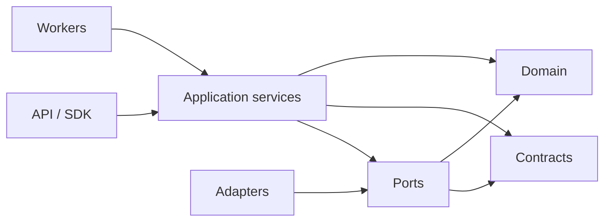
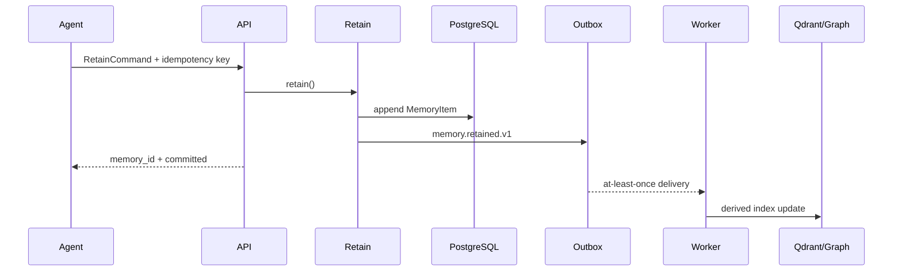
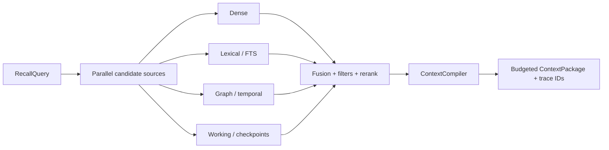
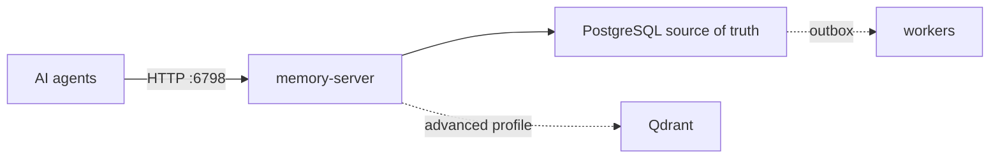

# Архитектура standalone memory server

Obelisk Memory — один self-hosted HTTP-сервер в Docker. Он обслуживает
агентов пользователя или команды и не содержит SaaS control plane, billing,
customer onboarding или облачной оркестрации.

## Архитектурные принципы

1. **PostgreSQL — единственный source of truth.** Qdrant, граф и FTS являются
   перестраиваемыми индексами.
2. **Append-only first.** Новое знание добавляется; исправление создаёт новую
   revision/supersedes-связь. Сырьё фоновые процессы не переписывают.
3. **Тяжёлая работа вне hot path.** Retain фиксирует атом и outbox event.
   Embedding, extraction, graph, dedupe и reflection выполняют workers.
4. **Provenance first.** Производное знание без evidence не считается памятью.
5. **Контекст компилируется.** Агент получает не «всё найденное», а бюджетный
   пакет под `chat_reply`, `planner`, `coder`, `critic` или `tool_call`.
6. **Project boundary в каждом слое.** Один deployment может хранить несколько
   локальных проектов. `tenant_id` является внутренним `server_id`, а
   `workspace_id` является `project_id`.

## Направление зависимостей

Domain ничего не знает о FastAPI, PostgreSQL, Qdrant, NATS или LLM. Поэтому
каждый adapter и каждый service можно менять независимо.

## Поток записи

В Docker-профиле `append` и outbox фиксируются одной PostgreSQL-транзакцией.
In-memory adapter повторяет семантику только для тестов.

## Поток чтения

Текущая формула baseline:

`0.35 semantic + 0.20 lexical + 0.15 entity + 0.10 recency + 0.10 importance + 0.10 trust`.

Весовые коэффициенты явные и заменяемые. Следующая итерация может добавить RRF,
cross-encoder и freshness verification без изменения `RecallQuery`.

## Слои памяти

| Layer | Назначение | Типичная политика |
|---|---|---|
| `working` | активный план, open loops, scratchpad | короткий TTL, почти всегда в context |
| `core` | persona, policy, task contract | pinned/read-only, всегда в context |
| `episodic` | события, turns, tool traces | append-only, time-aware |
| `semantic` | факты и предпочтения | hybrid recall, consolidation |
| `procedural` | навыки, playbooks, validated recipes | success/version metadata |
| `social` | peer beliefs, роли, доверие | private/team ACL, temporal edges |
| `reflection` | summaries, observations, mental models | evidence required |
| `error` | failures и anti-patterns | tool/task scoped |

## Consistency

- PostgreSQL commit означает «память принята».
- Индексы обновляются eventually consistent.
- `RecallResult.index_stale` является transport contract; runtime wiring к
  фактическому outbox lag ещё является обязательным production hardening.
- Consumer хранит processed event IDs и выдерживает повторную доставку.
- Outbox relay арендует события через PostgreSQL lease и подтверждает их только
  после JetStream persistence acknowledgement.
- Poison events после максимума попыток остаются аудируемыми в dead letter.
- Конфликт shared blocks решается optimistic revision/CAS.

## Deployment

Development Compose запускает `memory-server` и PostgreSQL, а профиль
`advanced` добавляет Qdrant, NATS, outbox relay, embedding worker и MinIO.
Production Compose включает эти компоненты во внутренней Docker-сети и
публикует только API/UI.

## Реализованные runtime-компоненты

- PostgreSQL ledger, RLS, append/CAS, provenance, conversations, proposals,
  checkpoints, audit и transactional outbox;
- Qdrant adapter и асинхронный embedding worker;
- NATS JetStream relay с leases, retries, dead-letter и consumer deduplication;
- OpenAI-compatible embedding и memory-LLM adapters;
- evidence-backed graph storage, reflection/conflict services и React UI;
- Markdown vault, signed import/export, backup/restore and release gates.

## Production boundaries

Текущий Docker deployment является single-node appliance, а не HA-кластером.
Полный production rollout дополнительно требует:

- identity policy, которая связывает ключ с tenant/workspace/agent и memory
  visibility;
- active-head semantics для supersede/archive/conflict decisions во всех
  candidate sources;
- fail-soft source isolation и отдельный readiness endpoint;
- безопасный multi-workspace reindex без удаления общей collection;
- полное шифрование чувствительных raw/provenance/checkpoint данных и backups;
- connection pooling, bounded queues, worker metrics, disaster recovery and
  target-environment release evidence.

Канонический список блокеров находится в
[PRODUCTION_GAP_AUDIT_2026_07_10.md](PRODUCTION_GAP_AUDIT_2026_07_10.md).
