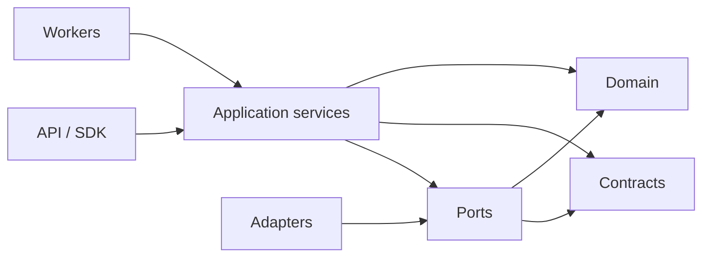
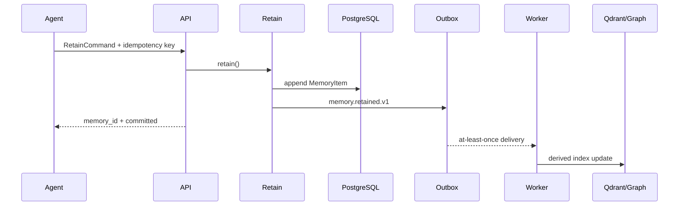
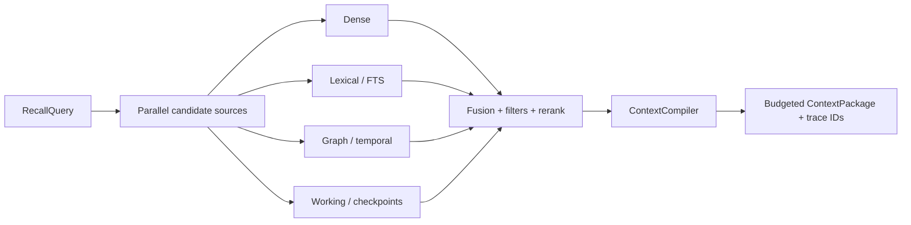

# Архитектура

## Принципы из исследований

1. **PostgreSQL — единственный source of truth.** Qdrant, граф и FTS являются
   перестраиваемыми индексами.
2. **Append-only first.** Новое знание добавляется; исправление создаёт новую
   revision/supersedes-связь. Сырьё фоновые процессы не переписывают.
3. **Тяжёлая работа вне hot path.** Retain фиксирует атом и outbox event.
   Embedding, extraction, graph, dedupe и reflection выполняют workers.
4. **Provenance first.** Производное знание без evidence не считается памятью.
5. **Контекст компилируется.** Агент получает не «всё найденное», а бюджетный
   пакет под `chat_reply`, `planner`, `coder`, `critic` или `tool_call`.
6. **Tenant boundary в каждом слое.** API policy + PostgreSQL RLS + payload
   filters. Namespace в индексе сам по себе не является защитой.

## Направление зависимостей

Domain ничего не знает о FastAPI, PostgreSQL, Qdrant, NATS или LLM. Поэтому
каждый adapter и каждый service можно менять независимо.

## Поток записи

В production `append` и `publish` должны быть одной SQL-транзакцией. Текущий
in-memory adapter повторяет семантику, но не заменяет production durability.

## Поток чтения

Текущая формула baseline:

`0.35 semantic + 0.20 lexical + 0.15 entity + 0.10 recency + 0.10 importance + 0.10 trust`.

Весовые коэффициенты явные и заменяемые. Следующая итерация может добавить RRF,
cross-encoder и freshness verification без изменения `RecallQuery`.

## Слои памяти

| Layer | Назначение | Типичная политика |
|---|---|---|
| `working` | активный план, open loops, scratchpad | короткий TTL, почти всегда в context |
| `core` | persona, policy, task contract | pinned/read-only, всегда в context |
| `episodic` | события, turns, tool traces | append-only, time-aware |
| `semantic` | факты и предпочтения | hybrid recall, consolidation |
| `procedural` | навыки, playbooks, validated recipes | success/version metadata |
| `social` | peer beliefs, роли, доверие | private/team ACL, temporal edges |
| `reflection` | summaries, observations, mental models | evidence required |
| `error` | failures и anti-patterns | tool/task scoped |

## Consistency

- PostgreSQL commit означает «память принята».
- Индексы обновляются eventually consistent.
- API должен отдавать `index_stale`, когда outbox lag выше порога.
- Consumer хранит processed event IDs и выдерживает повторную доставку.
- Конфликт shared blocks решается optimistic revision/CAS.

## Что намеренно не реализовано в foundation

- LLM extraction и модельный routing;
- реальные Postgres/Qdrant/NATS/S3 adapters;
- policy engine и identity provider;
- graph database;
- distributed worker leases;
- production readiness/metrics.

Для каждого пункта есть независимый work package.
